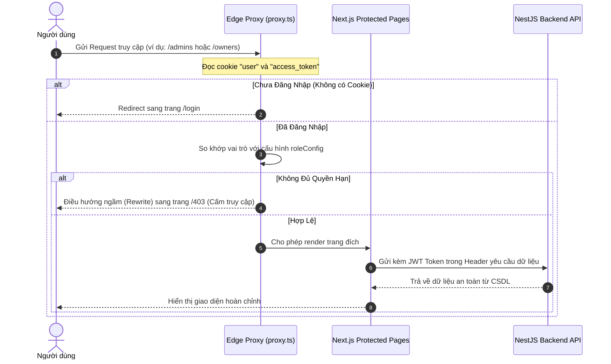

# 🗺️ MESHIMAP (ITSS-Nihongo2)

> **MESHIMAP** là một nền tảng tìm kiếm và đặt bàn nhà hàng hỗ trợ tiếng Nhật tại Việt Nam, được phát triển phục vụ cho dự án môn học **ITSS (Information Technology Special Subjects) - Tiếng Nhật 2** tại **Đại học Bách Khoa Hà Nội (HUST)**.
> Nền tảng được tối ưu hóa nhằm kết nối cộng đồng người Nhật sinh sống, làm việc hoặc du lịch tại Việt Nam với các nhà hàng có khả năng hỗ trợ ngôn ngữ, dịch vụ tiếng Nhật chất lượng cao.

---

## 🌟 Tính Năng Nổi Bật

Hệ thống được thiết kế và phân quyền chặt chẽ theo 3 vai trò (Roles) chính: **Khách hàng (Customer)**, **Chủ nhà hàng (Restaurant Owner)**, và **Quản trị viên (Admin)**.

### 1. Phân Hệ Khách Hàng (Customer)
*   **Bản đồ tìm kiếm tương tác cao (Interactive Search Map)**:
    *   Tích hợp bản đồ vector hiện đại thông qua **MapLibre GL JS** và **OpenFreeMap** (sử dụng style *Carto Voyager* trực quan và miễn phí).
    *   **Hỗ trợ chế độ ảnh vệ tinh (Satellite View)**: Sử dụng nguồn ảnh vệ tinh *Esri World Imagery* giúp khách hàng dễ dàng định vị thực tế mà không phát sinh chi phí API.
    *   **Bộ lọc danh mục động**: Lọc nhà hàng theo khu vực (quận, thành phố), đánh giá (rating) và các nhóm món ăn phổ biến (Sushi, Ramen, Pho, Izakaya...).
    *   **Đồng bộ danh sách - bản đồ (List-Map Sync)**: Rê chuột qua thẻ nhà hàng (card) sẽ tự động làm nổi bật (highlight) marker tương ứng trên bản đồ và ngược lại.
    *   **Marker phân biệt theo màu & Nhãn đại diện**: Tự động tô màu và gán biểu tượng chữ viết tắt cho từng nhóm ẩm thực, cùng với hiệu ứng vòng tròn sáng tỏa (halo glow) cho các marker đang hoạt động.
    *   **Marker Clustering & Popups**: Gom cụm các marker gần nhau giúp tối ưu hiệu năng hiển thị và mở popup mini-card chi tiết đầy đủ thông tin khi click.
*   **Chi tiết nhà hàng & Thực đơn (Menu & Details)**: Xem thông tin giới thiệu, danh sách thực đơn với tên tiếng Nhật, hình ảnh minh họa, giá cả và các huy hiệu đặc biệt (Chef Choice, Signature, Popular...).
*   **Đánh giá & Phản hồi (Reviews)**: Viết đánh giá bằng tiếng Nhật/tiếng Việt kèm điểm số (1-5 sao) và hình ảnh thực tế.
*   **Đặt bàn trực tuyến (Online Table Booking)**: Đặt bàn nhanh chóng với số lượng khách, ngày giờ cụ thể và gửi ghi chú trực tiếp tới nhà hàng.

### 2. Phân Hệ Chủ Nhà Hàng (Restaurant Owner)
*   **Quản lý thông tin nhà hàng**: Đăng ký nhà hàng, cập nhật tọa độ địa lý (vĩ độ, kinh độ), hình ảnh đại diện và chi tiết liên hệ.
*   **Xác thực năng lực tiếng Nhật (Japanese-Support Verification)**: Tải lên các tài liệu chứng minh khả năng hỗ trợ tiếng Nhật (chứng chỉ tiếng Nhật của nhân viên, giấy phép kinh doanh, thực đơn tiếng Nhật...) để Admin phê duyệt nhằm nhận huy hiệu xác thực trên hệ thống.
*   **Quản lý thực đơn (Menu Management)**: Thêm mới, chỉnh sửa món ăn, mức giá, mô tả bằng tiếng Việt/tiếng Nhật, gán emoji đặc trưng và huy hiệu khuyến nghị.
*   **Quản lý đặt bàn (Booking Dashboard)**: Tiếp nhận yêu cầu đặt bàn theo thời gian thực, duyệt (Approve) hoặc từ chối (Reject) kèm lý do chi tiết gửi tới khách hàng.
*   **Tương tác khách hàng**: Trả lời phản hồi, đánh giá từ khách hàng.
*   **Báo cáo & Phân tích (Analytics)**: Biểu đồ trực quan hóa doanh thu đặt bàn và thống kê đánh giá sao dựa trên thư viện **Chart.js** & **React-Chartjs-2**.

### 3. Phân Hệ Quản Trị Viên (Admin)
*   **Kiểm duyệt nhà hàng**: Phê duyệt hồ sơ đăng ký mới và hồ sơ tài liệu xác thực năng lực tiếng Nhật của các đối tác nhà hàng.
*   **Quản lý người dùng**: Khóa/mở khóa tài khoản khách hàng và chủ nhà hàng để bảo vệ môi trường ứng dụng lành mạnh.
*   **Quản lý phản hồi (Moderation)**: Tiếp nhận các báo cáo đánh giá tiêu cực hoặc sai sự thật, ẩn hoặc xóa các nội dung vi phạm.

---

## 🛠️ Công Nghệ Sử Dụng (Tech Stack)

### Frontend
*   **Framework chính**: **Next.js (v16.2.6)** với **App Router** tiên tiến và tối ưu SEO.
*   **Ngôn ngữ**: **TypeScript (v5)**.
*   **Styling**: **Tailwind CSS v4** kết hợp với Vanilla CSS tối ưu hiệu năng hiển thị.
*   **Maps & Geospatial**: **MapLibre GL JS (v5.24.0)**, `@maplibre/maplibre-gl-style-spec`, nguồn bản đồ **OpenFreeMap** & **Esri World Imagery**.
*   **Quản lý trạng thái**: React Hooks & Context API.
*   **Xác thực bảo mật**: **Edge Runtime Proxy** (`proxy.ts` thay cho `middleware.ts` truyền thống trên Next 16) kết hợp quản lý Cookies với thư viện **js-cookie**.
*   **Giao tiếp thời gian thực**: **Socket.io-client**.
*   **Biểu đồ báo cáo**: **Chart.js** & **React-Chartjs-2**.

### Backend
*   **Framework chính**: **NestJS (v11.0.1)**.
*   **ORM**: **TypeORM (v0.3.29)**.
*   **Cơ sở dữ liệu**: **PostgreSQL (v18.3)** với driver client `pg`.
*   **Xác thực & Phân quyền**: **Passport-JWT**, **Bcrypt** để mã hóa mật khẩu người dùng.
*   **Tài liệu API**: **Swagger** (`@nestjs/swagger`) tạo trang thử nghiệm API tự động tại `/api`.
*   **Gửi email thông báo**: **Nodemailer** kết hợp dịch vụ SMTP phục vụ gửi xác nhận đặt bàn.
*   **Realtime**: **Websockets** với `@nestjs/websockets` và **Socket.io**.
*   **Validate dữ liệu**: `class-validator` & `class-transformer`.

---

## 📐 Kiến Trúc Bảo Mật & Phân Quyền (RBAC Flow)

MESHIMAP sử dụng cơ chế bảo vệ phân quyền trên máy chủ thông qua **Proxy** của Next.js 16 ở tầng Edge Runtime để kiểm tra quyền truy cập trước khi trang web được tải về phía Client. Điều này hạn chế tối đa rủi ro lộ lọt thông tin so với các phương pháp Client-side thông thường.



---

## 🗄️ Sơ Đồ Cơ Sở Dữ Liệu (Database Schema)

Dữ liệu của MESHIMAP được chuẩn hóa cao trong PostgreSQL với các mối quan hệ được quản lý bởi TypeORM:

```mermaid
erDiagram
    USERS ||--o[1] RESTAURANTS : "owner_of"
    USERS ||--o{ BOOKINGS : "places"
    USERS ||--o{ REVIEWS : "writes"
    USERS ||--o{ NOTIFICATIONS : "receives"
    
    RESTAURANTS ||--o{ MENU_ITEMS : "has"
    RESTAURANTS ||--o{ BOOKINGS : "receives"
    RESTAURANTS ||--o{ REVIEWS : "gets"
    RESTAURANTS ||--o|1 RESTAURANT_DOCUMENTS : "verified_by"

    USERS {
        int id PK
        string email UK
        string password
        users_role_enum role "customer | restaurant_owner | admin"
        string name
        string name_kana
        string nickname
        boolean is_active
        timestamp created_at
        timestamp updated_at
    }

    RESTAURANTS {
        int id PK
        string name
        string name_jp
        string category
        numeric rating
        text address
        string district
        string city
        text description
        string phone
        boolean has_japanese_support
        double latitude
        double longitude
        text image_url
        int owner_id FK
        approval_status status "pending | approved | rejected"
        text reject_reason
        timestamp created_at
        timestamp updated_at
    }

    MENU_ITEMS {
        int id PK
        int restaurant_id FK
        string name
        string name_jp
        numeric price
        text description
        string category
        string image_url
        string badge
        string emoji
        timestamp created_at
    }

    BOOKINGS {
        int id PK
        int user_id FK
        int restaurant_id FK
        date booking_date
        time booking_time
        int guests
        text note
        bookings_status_enum status "pending | confirmed | cancelled | completed"
        text reject_reason
        timestamp created_at
        timestamp updated_at
    }

    REVIEWS {
        int id PK
        int user_id FK
        int restaurant_id FK
        int stars "1-5"
        string title
        text content
        text owner_reply
        date visit_date
        boolean is_reported
        text report_reason
        timestamp created_at
    }

    RESTAURANT_DOCUMENTS {
        int id PK
        int restaurant_id FK
        string japanese_proof
        string business_license
        string food_safety_cert
        string identity_card
        timestamp created_at
        timestamp updated_at
    }

    NOTIFICATIONS {
        int id PK
        int user_id FK
        string title
        text content
        boolean is_read
        string type
        timestamp created_at
    }
```

---

## 📁 Cấu Trúc Dự Án

Dự án được phân chia thành cấu trúc Monorepo dễ quản lý gồm hai phần độc lập `frontend` và `backend`:

```text
ITSS-Nihongo2/
├── backend/                       # NestJS Application
│   ├── src/
│   │   ├── admin/                 # Module xử lý quyền quản trị viên
│   │   ├── auth/                  # Module xác thực JWT, Đăng ký/Đăng nhập
│   │   ├── booking/               # Module đặt bàn
│   │   ├── common/                # Các bộ lọc lỗi, interceptor, middleware dùng chung
│   │   ├── mail/                  # Dịch vụ gửi email tự động (Nodemailer)
│   │   ├── notification/          # Module thông báo người dùng
│   │   ├── restaurant/            # Module thông tin nhà hàng và định vị bản đồ
│   │   ├── review/                # Module đánh giá sao
│   │   ├── user/                  # Module quản lý hồ sơ người dùng
│   │   ├── app.module.ts          # Module tổng của ứng dụng
│   │   └── main.ts                # File khởi chạy ứng dụng backend
│   ├── test/                      # Unit test & E2E test
│   ├── backup.sql                 # File sao lưu dữ liệu PostgreSQL mẫu
│   ├── .env.example               # Biến môi trường mẫu cho backend
│   └── package.json
│
├── frontend/                      # Next.js Application (Next 16 & React 19)
│   ├── app/                       # Thư mục định tuyến (App Router)
│   │   ├── (public)/              # Các trang công khai (/login, /register, /search, /)
│   │   ├── (users)/               # Các trang cho khách hàng đã đăng nhập (/profile, /booking)
│   │   ├── admins/                # Giao diện dành riêng cho Admin quản trị
│   │   ├── owners/                # Giao diện quản lý của Chủ nhà hàng
│   │   ├── 403/                   # Trang lỗi cấm truy cập
│   │   ├── globals.css            # CSS toàn cục & định hình giao diện bản đồ
│   │   └── layout.tsx             # Layout bọc ngoài hệ thống
│   ├── components/                # Thư mục chứa các UI Component dùng chung
│   ├── config/
│   │   └── roles.ts               # Khai báo cấu hình phân quyền đường dẫn (RBAC map)
│   ├── public/                    # Tài sản tĩnh (hình ảnh, biểu tượng)
│   ├── proxy.ts                   # Next.js Server-side edge proxy điều hướng an toàn
│   └── package.json
│
├── CHANGELOG_MAP_PLAN_A.html      # Nhật ký xây dựng hệ thống bản đồ tích hợp
├── CHANGELOG_RBAC.md              # Nhật ký chuyển đổi cơ chế bảo mật cookies & proxy
└── README.md                      # Hướng dẫn dự án này
```

---

## 🚀 Hướng Dẫn Cài Đặt & Chạy Thử Dự Án

### Yêu Cầu Hệ Thống
*   **Node.js**: Phiên bản 18.x trở lên.
*   **PostgreSQL**: Phiên bản 15.x trở lên.

### Bước 1: Chuẩn Bị Cơ Sở Dữ Liệu
1.  Mở công cụ dòng lệnh hoặc pgAdmin của PostgreSQL.
2.  Tạo một cơ sở dữ liệu mới có tên là `ITSS Nhat` (hoặc tên tùy chọn của bạn):
    ```sql
    CREATE DATABASE "ITSS Nhat";
    ```
3.  Phục hồi dữ liệu từ file sao lưu `backup.sql` nằm trong thư mục `backend/`:
    ```bash
    psql -U postgres -d "ITSS Nhat" -f backend/backup.sql
    ```
    *(Thay đổi `-U postgres` thành tài khoản quản trị của PostgreSQL tương ứng nếu cần)*.

### Bước 2: Thiết Lập & Khởi Chạy Backend
1.  Di chuyển vào thư mục backend:
    ```bash
    cd backend
    ```
2.  Cài đặt các gói phụ thuộc:
    ```bash
    npm install
    ```
3.  Tạo file `.env` từ file mẫu `.env.example`:
    ```bash
    cp .env.example .env
    ```
4.  Cấu hình chính xác thông tin kết nối CSDL và JWT Secret trong file `.env`:
    ```env
    DB_HOST=localhost
    DB_PORT=5432
    DB_USERNAME=postgres
    DB_PASSWORD=your_postgres_password    # Thay đổi bằng mật khẩu của bạn
    DB_NAME=ITSS Nhat
    JWT_SECRET=ITSS
    ```
5.  Khởi chạy Backend ở chế độ phát triển (Development):
    ```bash
    npm run start:dev
    ```
    *Ứng dụng backend sẽ khởi chạy tại cổng mặc định: `http://localhost:3001`.*
    *Tài liệu API Swagger có thể truy cập tại: `http://localhost:3001/api`.*

### Bước 3: Thiết Lập & Khởi Chạy Frontend
1.  Di chuyển vào thư mục frontend:
    ```bash
    cd ../frontend
    ```
2.  Cài đặt các gói phụ thuộc:
    ```bash
    npm install
    ```
3.  Tạo file `.env.local` để cấu hình biến môi trường kết nối đến API backend:
    ```env
    NEXT_PUBLIC_API_BASE_URL=http://localhost:3001
    ```
4.  Khởi chạy Frontend ở chế độ phát triển (Development):
    ```bash
    npm run dev
    ```
    *Mở trình duyệt truy cập: `http://localhost:3000` để trải nghiệm dự án.*

---

## 👥 Tài Khoản Thử Nghiệm Mẫu

Để thuận tiện trong quá trình kiểm thử các phân hệ chức năng khác nhau, bạn có thể sử dụng các tài khoản mẫu có sẵn trong file backup CSDL dưới đây:

| Vai trò (Role) | Email tài khoản | Mật khẩu mẫu | Mô tả chức năng kiểm thử |
| :--- | :--- | :--- | :--- |
| **Admin** | `admin@vietnambooking.jp` | *Xem trong DB* | Kiểm duyệt tài liệu nhà hàng, phê duyệt hiển thị. |
| **Restaurant Owner** | `owner.pho@gmail.com` | *Xem trong DB* | Quản lý nhà hàng Phở Hòa, duyệt đặt bàn, thay đổi menu. |
| **Customer** | `tanaka.taro@example.jp` | *Xem trong DB* | Tìm kiếm trên bản đồ, thực hiện đặt bàn và viết review. |

---

## 📄 Bản Quyền
Dự án được phân phối dưới giấy phép **MIT License**. Mọi đóng góp và cải tiến phục vụ học tập môn học ITSS đều được hoan nghênh.